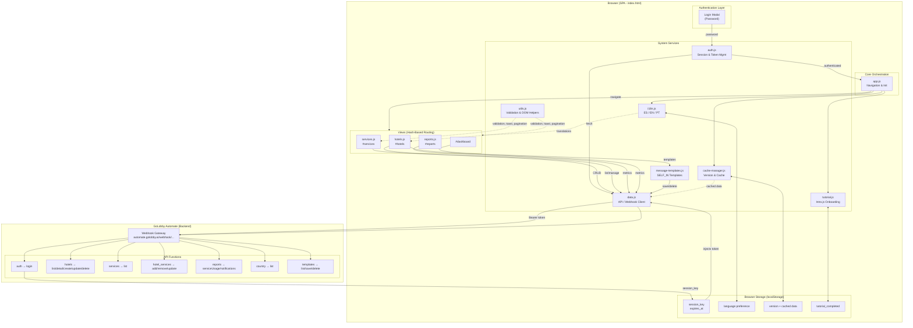

# Hotel Notify Hub — Architecture

## Stack

| Capa | Tecnología |
|------|-----------|
| Frontend | Vanilla JS, HTML5, CSS3 (sin framework) |
| Routing | Hash-based SPA (`#hotels`, `#services`, etc.) |
| Backend | GoLobby Automate (webhook gateway) |
| Auth | Password → Bearer token → localStorage |
| i18n | ES / EN / PT |
| Icons | Lucide (CDN) |
| Tutorial | Intro.js (CDN) |
| Tests | Jest (unit/integration) + Playwright (E2E) |

---

## Estructura de archivos

```
hotel-notify-hub/
├── index.html                  # Entrada única (SPA)
├── package.json                # v1.3.3
├── babel.config.js
├── playwright.config.js
├── js/
│   ├── app.js                  # Orquestación, navegación, init
│   ├── auth.js                 # Sesión, login, logout, token
│   ├── data.js                 # Cliente API / webhook
│   ├── hotels.js               # CRUD hoteles + UI
│   ├── services.js             # Gestión de servicios + UI
│   ├── reports.js              # Reportes y gráficas
│   ├── cache-manager.js        # Versionado y caché
│   ├── i18n.js                 # Traducciones
│   ├── message-templates.js    # Templates SELF_IN
│   ├── tutorial.js             # Onboarding Intro.js
│   └── utils.js                # Validación, DOM helpers, toast
├── styles/
│   ├── main.css
│   ├── components.css
│   └── language-selector.css
└── tests/
    ├── unit/
    ├── integration/
    ├── e2e/
    ├── performance/
    ├── utils/
    └── setup.js
```

---

## Diagrama de arquitectura



---

## API

**Base URL:** `https://automate.golobby.ai/webhook/8486e672-cf9e-4fd6-8eea-09f48babbf1a`

**Patrón:** `?func={func}&method={method}&session_key={key}&...params`

**Auth:** `Authorization: Bearer {session_key}` en cada request

| func | methods |
|------|---------|
| `auth` | `login` |
| `hotels` | `list`, `detail`, `create`, `update`, `delete` |
| `services` | `list` |
| `hotel_services` | `add`, `remove`, `update` |
| `reports` | `serviceUsage`, `notifications` |
| `country` | `list` |
| `templates` | `list`, `save`, `delete` |

**Response format:**
```json
{ "ok": true, "data": { "items": [], "total": 0 } }
{ "ok": false, "error": "mensaje de error" }
```

Un `401` dispara logout automático.

---

## Módulos — responsabilidades

### `app.js`
- Orquesta el inicio de la app tras autenticación
- Maneja la navegación hash-based y el historial del browser
- Inicializa i18n, caché y tutorial
- Carga la vista activa con `initializeCurrentView()`

### `auth.js`
- Verifica sesión guardada en localStorage al inicio
- Ejecuta login contra webhook y guarda `session_key` + `expires_at`
- Inyecta el token en cada llamada via `addSessionKeyToWebhook()`
- Gestiona logout y expiración de sesión

### `data.js`
- Único punto de contacto con el backend
- Todas las funciones son `async` y retornan `{ ok, data }` o `{ ok, error }`
- Detecta 401 y llama a `logout()` automáticamente

### `hotels.js`
- Tabla paginada (10/página) con búsqueda y filtros client-side
- Modal para crear/editar hoteles
- Gestión de servicios activos por hotel (add/remove/update)
- Exportación CSV

### `services.js`
- Lista todos los servicios disponibles con conteo de suscriptores
- Modal para ver qué hoteles tienen cada servicio
- Permite dar de baja hoteles de un servicio

### `reports.js`
- Gráficas de uso por servicio y notificaciones mensuales
- Filtros por rango de fechas

### `cache-manager.js`
- Detecta cambios de versión (v1.3.3) y limpia localStorage automáticamente
- Expone `forceUpdate()` para forzar recarga

### `i18n.js`
- Traducciones ES/EN/PT guardadas en memoria
- Actualiza el DOM buscando atributos `data-i18n`
- Persiste la preferencia en `hotel_notify_hub_language`

### `utils.js`
- Validación: email, teléfono, código de hotel
- UI helpers: `showToast()`, `openModal()`, `closeModal()`
- Paginación: `paginate()`, `renderPagination()`
- Formularios: `getFormData()`, `setFormData()`, `resetForm()`

### `message-templates.js`
- Templates de mensajes para el servicio `SELF_IN`
- CRUD de templates via `data.js`

### `tutorial.js`
- Guía paso a paso con Intro.js
- 3 tours: dashboard (7 pasos), hotels (4 pasos), services (3 pasos)
- Se activa automáticamente la primera vez y se puede saltar

---

## Modelo de datos

### Hotel
```json
{
  "id": 1,
  "hotel_code": "ABC01",
  "hotel_name": "Hotel Nombre",
  "email": "info@hotel.com",
  "phone": "+34600000000",
  "language": "es",
  "country": "ES",
  "active": true,
  "created_at": "2024-01-01",
  "updated_at": "2024-01-01",
  "active_services": [
    {
      "service_id": 1,
      "service_code": "CHECKOUT",
      "send_by_email": true,
      "send_by_whatsapp": false,
      "status_in": null
    }
  ]
}
```

### Service
```json
{
  "id": 1,
  "service_code": "SELF_IN",
  "service_name": "Self Check-in",
  "description": "...",
  "active": true,
  "hotels_subscribed": 12
}
```

**Servicios conocidos:** `BOENGINE`, `CHECKOUT`, `MAINTENANCE`, `PAYMENT`, `SELF_IN`

> `SELF_IN` tiene el campo especial `status_in` (ON/OFF) para automatización de check-in.

---

## Estado global (window scope)

| Variable | Descripción |
|----------|-------------|
| `currentView` | Vista activa actual |
| `sessionKey` | Token de sesión autenticado |
| `isAuthenticated` | Flag de autenticación |
| `currentLanguage` | Idioma activo (es/en/pt) |
| `hotelsCache` | Lista de hoteles en memoria |
| `countriesCache` | Lista de países en memoria |
| `servicesCache` | Lista de servicios en memoria |
| `cacheManager` | Instancia del cache manager |
| `i18n` | Instancia del sistema de traducciones |

---

## Tests

```bash
npm test                   # Unit tests (Jest)
npm run test:watch         # Watch mode
npm run test:coverage      # Coverage report
npm run test:integration   # Integration tests
npm run test:e2e           # E2E tests (Playwright/Chromium)
npm run test:performance   # Performance tests
npm run test:full          # Todos los tests
```

---

## Dev server

```bash
npm run serve   # http-server en puerto 8080
```

No hay build step — la app se sirve tal cual (vanilla JS + HTML + CSS).
